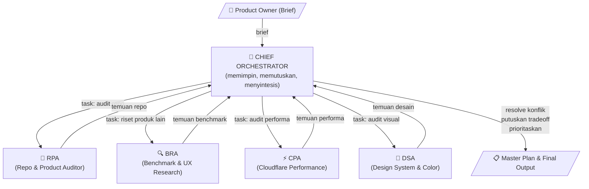
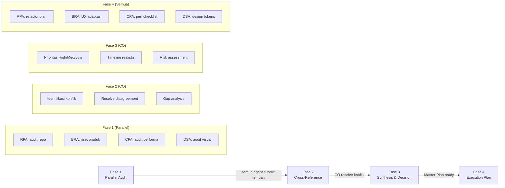
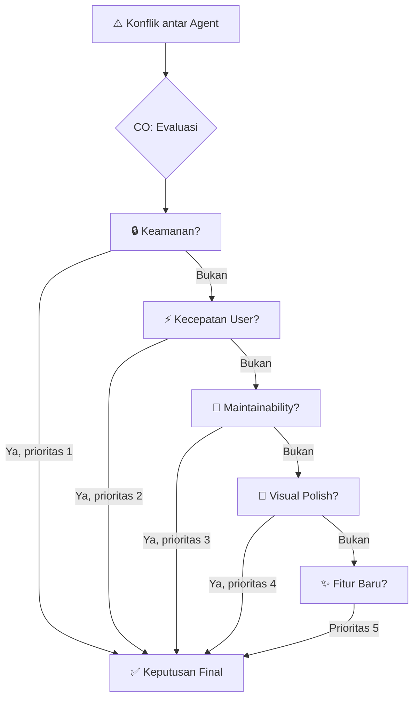

# Arsitektur Multi-Agent Wesley

## Diagram Sistem

```
┌─────────────────────────────────────────────────────────────┐
│                    CHIEF ORCHESTRATOR (CO)                    │
│          Memimpin · Memutuskan · Menyintesis · Veto          │
└──────┬──────────┬──────────────┬──────────────┬─────────────┘
       │          │              │              │
┌──────▼───┐ ┌────▼─────┐ ┌─────▼──────┐ ┌────▼──────┐
│   RPA    │ │   BRA    │ │    CPA     │ │    DSA    │
│  Repo &  │ │Benchmark │ │Cloudflare  │ │  Design   │
│ Product  │ │  & UX    │ │Performance │ │  System   │
│ Auditor  │ │ Research │ │ Architect  │ │  & Color  │
└──────────┘ └──────────┘ └────────────┘ └───────────┘
```

## Diagram Cara Kerja Sama (Mermaid)



## Diagram Alur Fase Kerja (Mermaid)



## Diagram Resolusi Konflik (Mermaid)



## Prinsip Arsitektur

### 1. Separation of Concerns
Setiap agent punya domain yang jelas. Tidak ada agent yang mengerjakan tugas agent lain.

### 2. Parallel Execution
Agent RPA, BRA, CPA, dan DSA bekerja bersamaan di Fase 1. Tidak perlu menunggu satu sama lain.

### 3. Conflict Resolution via CO
Ketika dua agent memberikan rekomendasi yang bertentangan, CO yang memutuskan berdasarkan:
- Realitas stack (Cloudflare + Firebase + D1)
- Budget waktu dan effort
- Impact terhadap user experience
- Production readiness

### 4. Production-First Mindset
Semua rekomendasi harus bisa diimplementasikan di:
- Cloudflare Pages (frontend hosting)
- Cloudflare Workers (backend API)
- Cloudflare D1 (database SQLite)
- Firebase Auth (autentikasi Google)
- Google Sheets (backup via Apps Script)

Tidak ada rekomendasi yang membutuhkan infrastruktur tambahan di luar stack ini.

## Aliran Data

```
Input (Brief dari Owner)
    │
    ▼
CO memecah brief → Task per agent
    │
    ├──→ RPA: "Audit repo, peta domain, identifikasi debt"
    ├──→ BRA: "Riset Trello + Linear + repo GitHub"
    ├──→ CPA: "Audit performa, bundle, query"
    └──→ DSA: "Audit visual, identifikasi masalah desain"
    │
    ▼
Semua agent submit temuan ke CO
    │
    ▼
CO: Cross-reference, resolve konflik
    │
    ▼
CO: Master Plan (prioritas + timeline)
    │
    ▼
Eksekusi bertahap
```

## Batasan Sistem

| Constraint | Alasan |
|-----------|--------|
| Tidak boleh tambah database lain | D1 adalah satu-satunya DB |
| Tidak boleh ganti auth provider | Firebase Auth sudah production |
| Tidak boleh pakai framework lain | SvelteKit sudah dipilih |
| Tidak boleh tambah CDN lain | ImgBB + ImageKit sudah cukup |
| Semua harus edge-first | Cloudflare Workers = no cold start |
| Budget dependency minimal | Setiap npm install harus justified |
