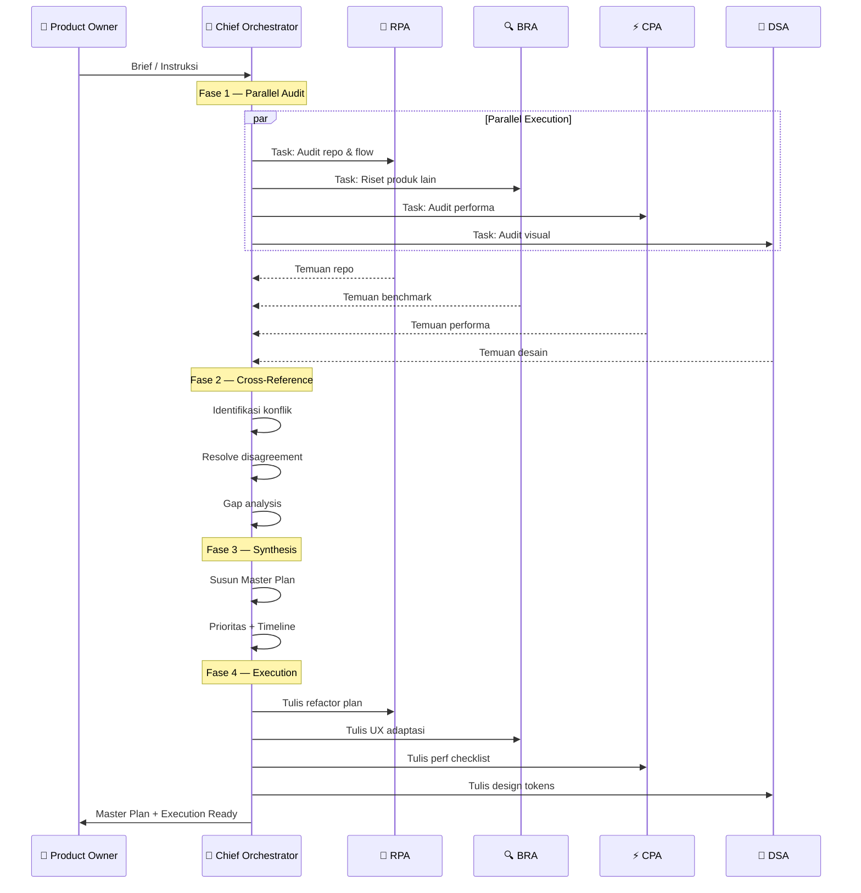

# Operating Model — Urutan Kerja Agent

## Diagram Cara Kerja Sama

```
┌─────────────────────────────────────────────────────────┐
│                   CHIEF ORCHESTRATOR                      │
│         (memimpin, memutuskan, menyintesis)              │
└────────────┬──────────┬──────────┬──────────┬───────────┘
             │          │          │          │
     ┌───────▼──┐ ┌─────▼────┐ ┌──▼─────┐ ┌──▼──────┐
     │   RPA    │ │   BRA    │ │  CPA   │ │   DSA   │
     │ (repo)   │ │(research)│ │(speed) │ │(design) │
     └───────┬──┘ └─────┬────┘ └──┬─────┘ └──┬──────┘
             │          │          │          │
             └──────────┴──────────┴──────────┘
                         │
                    CO menerima semua
                    temuan, resolves
                    konflik, outputs
                    final plan
```

## Diagram Mermaid — Alur Kerja Lengkap



## Fase 1: Parallel Audit

**Durasi:** Semua agent bekerja bersamaan.

| Agent | Task | Output |
|-------|------|--------|
| RPA | Baca repo, peta domain, audit kualitas kode | `outputs/audit-results/repo-audit.md` |
| BRA | Riset Trello, Linear, Notion, repo GitHub | `outputs/benchmarks/ux-benchmark.md` |
| CPA | Audit performa, bundle, query, loading | `outputs/performance-report/perf-audit.md` |
| DSA | Audit visual saat ini, identifikasi masalah | `outputs/design-system/visual-audit.md` |

## Fase 2: Cross-Reference

**Durasi:** CO memimpin.

CO mengumpulkan semua temuan dan mengidentifikasi:
- **Konflik:** DSA mau X, CPA bilang X terlalu berat → CO putuskan
- **Overlap:** RPA dan CPA sama-sama temukan masalah query → CO gabungkan
- **Gap:** Area yang tidak ter-cover oleh agent manapun → CO assign

## Fase 3: Synthesis & Decision

**Durasi:** CO menyusun Master Plan.

Output: `outputs/master-plan.md` berisi:
1. Prioritas implementasi (High/Medium/Low)
2. Timeline realistis
3. Dependency antar task
4. Risk assessment
5. Tradeoff yang sudah diputuskan

## Fase 4: Execution Plan

**Durasi:** Semua agent menulis spesifikasi implementasi.

| Agent | Output |
|-------|--------|
| RPA | Refactoring plan + migration steps |
| BRA | UX pattern yang diadaptasi + wireframe deskriptif |
| CPA | Performance optimization checklist |
| DSA | Design tokens + component spec + color system |
| CO | Final approval + execution order |

## Aturan Interaksi Antar Agent

1. **Agent tidak boleh langsung mengubah output agent lain** — harus via CO
2. **Jika ada disagreement** — CO yang memutuskan, keputusan final
3. **Setiap agent boleh request info dari agent lain** — via CO sebagai mediator
4. **Output harus concrete** — bukan "perbaiki spacing" tapi "ganti gap-2 jadi gap-3 di KanbanList.svelte baris 361"
